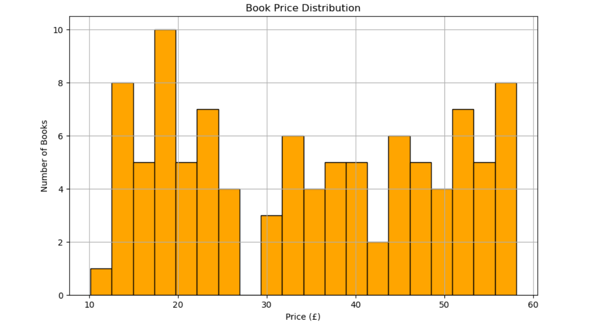

# 📚 Book Price Scraper – Web Scraping Project

This project uses web scraping to extract book data from [Books to Scrape](http://books.toscrape.com), a website designed for practicing web scraping. It collects book titles, prices, and availability from multiple pages, stores the results in a CSV file, and visualizes the price distribution.

---

## 🚀 Features

- Scrapes **book title**, **price**, and **availability**
- Loops through the **first 5 pages** of book listings
- Cleans and stores the data in a **Pandas DataFrame**
- Saves scraped data to a **CSV file**
- Generates a **histogram of book prices**

---

## 🛠️ Technologies Used

- Python
- Jupyter Notebook
- `requests` – HTTP requests
- `BeautifulSoup` – HTML parsing
- `pandas` – Data processing
- `matplotlib` – Data visualization

---

## screenshots



## 📦 Installation

Make sure you have Python and Jupyter Notebook installed. Then install required libraries:

```bash
pip install requests beautifulsoup4 pandas matplotlib
